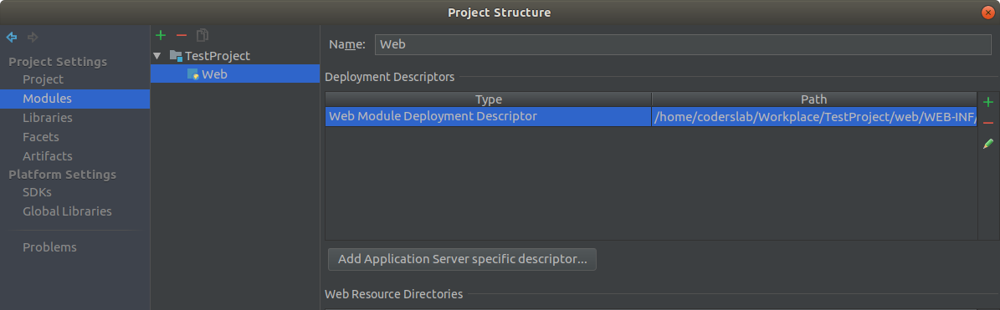
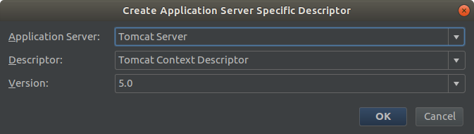

# Project Setup Guide

## Preparation – CSS/JS Files

You can place your **CSS** files in the directory:

```
src/main/webapp/css
```

With this location, include them in your JSP template files as follows:

```html
<link href='<c:url value="/css/style.css"/>' rel="stylesheet" type="text/css">
```

An example servlet, `HomeServlet`, is included in the project. It points to `home.jsp`, which correctly displays the main homepage layout.

---

## Database Connection Configuration

The configuration file is located in:

```
src/main/webapp/META-INF
```

**Modify the database connection settings inside this file.**

---

## Fixing the Error:
```
javax.naming.NameNotFoundException: Name [jdbc/scrumlab] is not bound in this Context. Unable to find [jdbc].
```

If this error occurs, follow the steps below:

1. From the top menu, select **File → Project Structure...**
2. In the window that appears, click **Facets** on the left and then select **Web**.
3. A dialog will appear — click **Add Application Server specific descriptor...**



4. Choose **Tomcat** from the list and confirm with **OK**.



5. A file named **Tomcat Context Descriptor** will appear on the list. Confirm with **OK**.


After adding it, the file will be located in:

```
src/main/webapp/META-INF
```

**Modify the database connection settings inside this file.**
